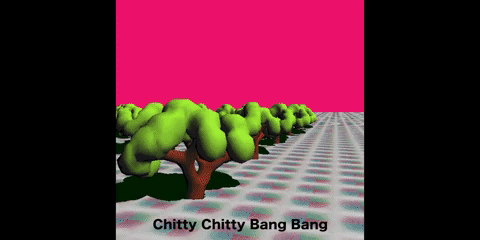

# 3D-Graphics-Project

**Overview**  
An interactive 3D world incorporating a variety of features such as:  
• a steerable vehicle  
• diffuse and specular shading  
• an infinite plane  
• shadows  
• toggleable camera angles

**Built With**  
The project was developed using C++ and OpenGL in Xcode.  

**Directory Descriptions**  
• build: contains an executable file containing the interactive 3D world  
• docs: contains basic documentation on the project, including a more comprehensive list of features  
• src: contains two source code files  
• tools: contains files used for materials and objects  
  
**Project demonstration**   
Below are short videos showcasing some of the features implemented in the project.  
  
  
  
  
  
  
**Acknowledgements**  
stbi_image.c was written by outside developers, listed within the file.  
Skeleton code for main.cpp was written by Balázs Csébfalvi, a professor  
at the Budapest University of Technology and Economics.

